# Wazuh SOC Home Lab

This is a small SOC lab I built to get hands-on experience with Wazuh and understand how endpoint logs, detection rules and automated responses work together.

The lab runs in VMware and includes a Wazuh server, a Windows 10 endpoint and an Ubuntu endpoint.

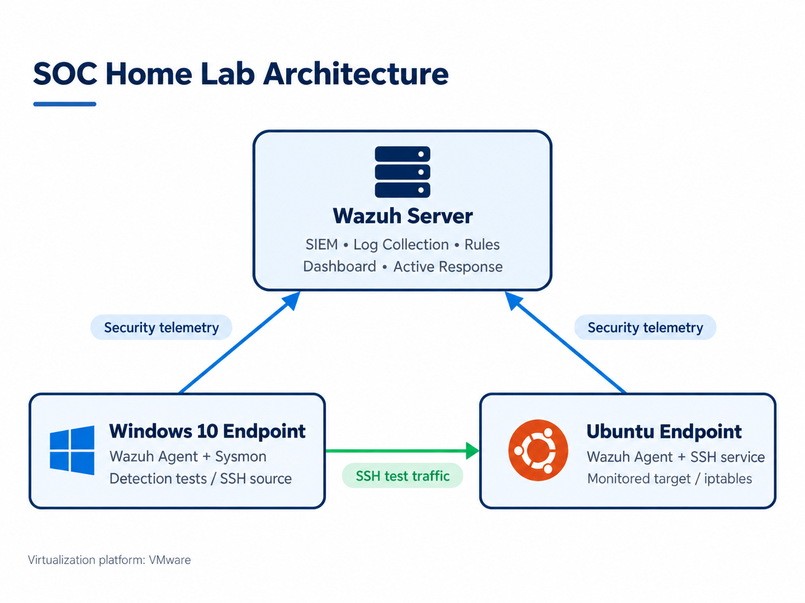

## Lab setup

| System | Role |
|---|---|
| Wazuh Server | Log collection, alerting, dashboards and Active Response |
| Windows 10 | Wazuh Agent + Sysmon |
| Ubuntu 24.04 LTS | Wazuh Agent + SSH service |
| VMware | Virtualization platform |

Both endpoints were connected to Wazuh and used throughout the tests.

Sysmon on the Windows endpoint used Olaf Hartong's community configuration downloaded from GitHub. I used the configuration as provided, without custom modifications.

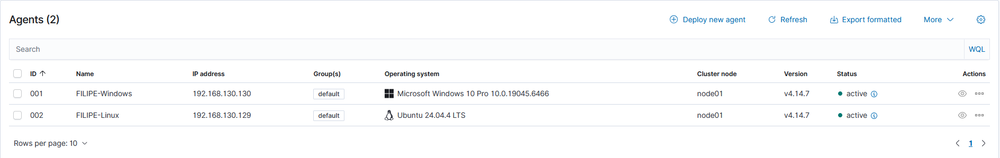

## What I wanted to learn

The main goal was to move beyond theory and get some basic practical experience with a SIEM.

I focused on:

- installing and configuring Wazuh and its agents;
- collecting Windows and Linux events;
- creating custom detection rules;
- checking whether those rules actually triggered;
- building a simple dashboard;
- investigating alerts;
- using Active Response to block repeated SSH authentication attempts.

## Dashboard

I created a basic dashboard to keep the main activity in one place.

It shows:

- failed Windows logons;
- failed SSH authentication on Linux;
- Windows account changes.

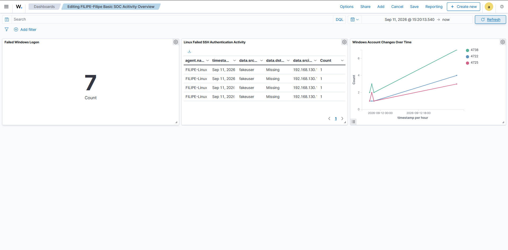

## Custom rules

I created two custom rules in `local_rules.xml`.

| Rule ID | Level | Purpose |
|---|---:|---|
| `100101` | 10 | Detect 3 or more failed SSH logins from the same IP within 2 minutes |
| `100200` | 12 | Detect when the Windows Guest account is enabled |

The brute-force rule was mapped to MITRE ATT&CK `T1110`, and the Windows account rule to `T1098`.

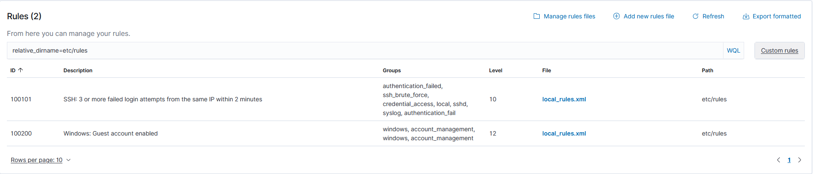


Full rules file: [`rules/local_rules.xml`](rules/local_rules.xml)

### SSH brute-force rule

```xml
<rule id="100101" level="10" frequency="3" timeframe="120">
  <if_matched_sid>5760</if_matched_sid>
  <same_srcip />
  <description>SSH: 3 or more failed login attempts from the same IP within 2 minutes</description>
  <mitre>
    <id>T1110</id>
  </mitre>
  <group>authentication_failed,ssh_brute_force,credential_access</group>
</rule>
```

I used this rule because I wanted Wazuh to react to a pattern of repeated failures, instead of treating each failed login as a separate event.

## Detection tests

### 1. SSH brute force

From the Windows machine, I generated several failed SSH login attempts against the Ubuntu endpoint.

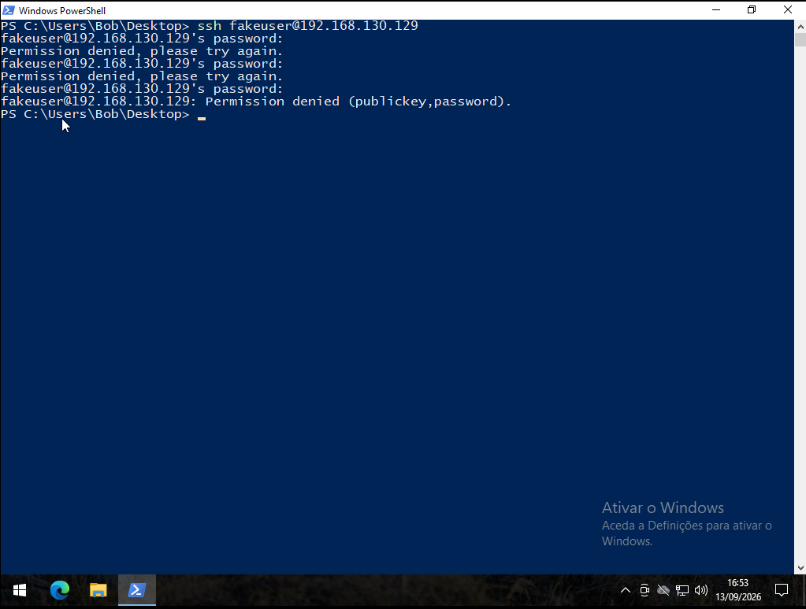

Wazuh triggered the custom rule after three failed attempts from the same source IP within two minutes.

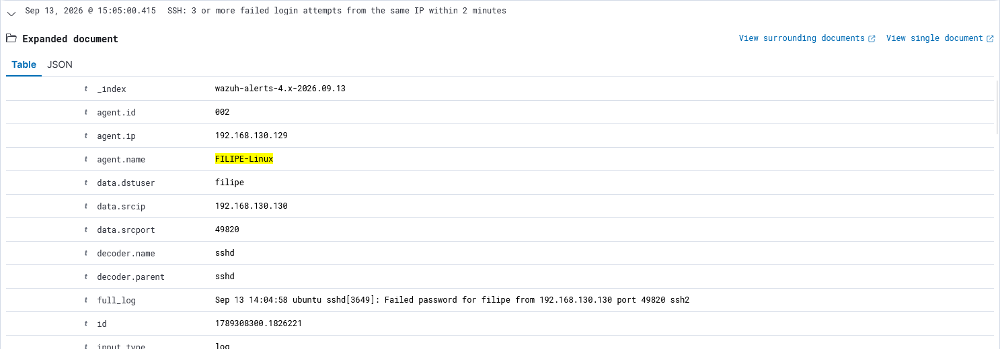

During the investigation I checked the source IP, destination host, username, SSH event details and the rule that triggered.

**Verdict:** True Positive  
**MITRE ATT&CK:** `T1110 - Brute Force`

### 2. Windows Guest account enabled

I enabled the built-in Windows Guest account to test whether the account-management rule would detect the change.

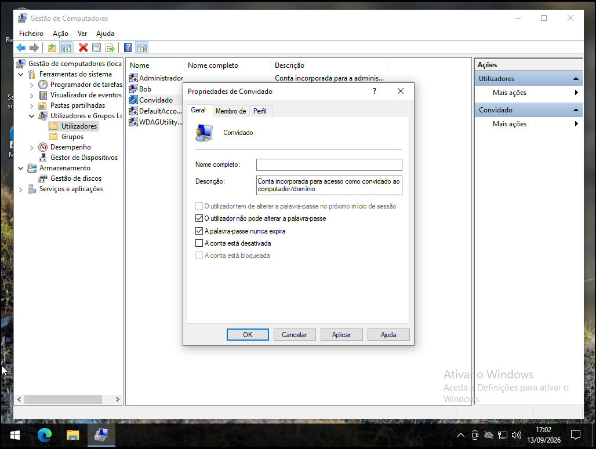

The corresponding Wazuh alert was generated as expected.

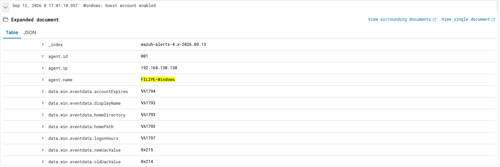

**MITRE ATT&CK:** `T1098 - Account Manipulation`

### 3. PowerShell activity

I also checked how PowerShell activity appeared through Sysmon and Wazuh.

For this test I only used the harmless `whoami` command.

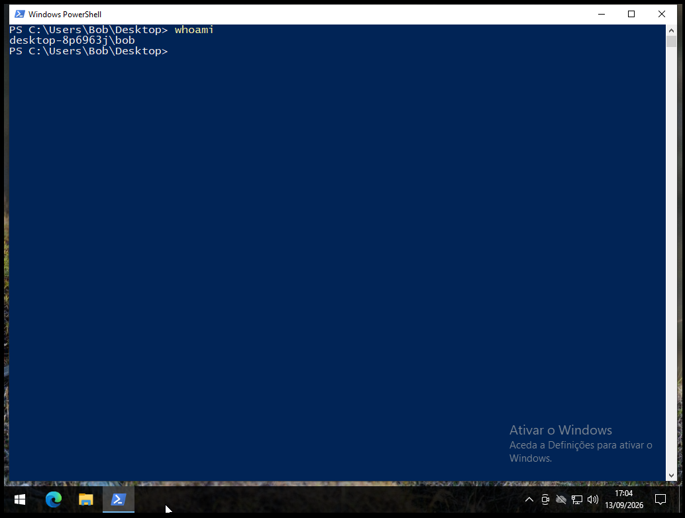

Wazuh showed the related PowerShell process activity and associated it with MITRE ATT&CK `T1059.001`.

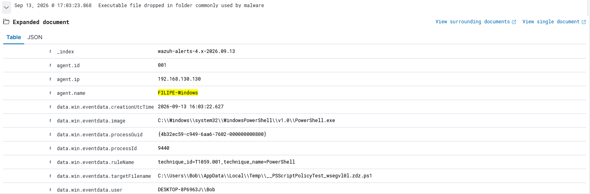

This was a monitoring test, not a malicious PowerShell simulation.

## Active Response

The SSH brute-force rule was also connected to Wazuh Active Response.

```xml
<active-response>
  <disabled>no</disabled>
  <command>firewall-drop</command>
  <location>local</location>
  <rules_id>100101</rules_id>
</active-response>
```

Configuration file: [`config/active-response.xml`](config/active-response.xml)

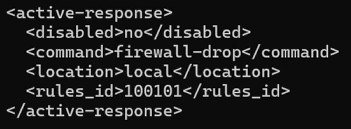

After the brute-force rule triggered, Wazuh executed `firewall-drop`.

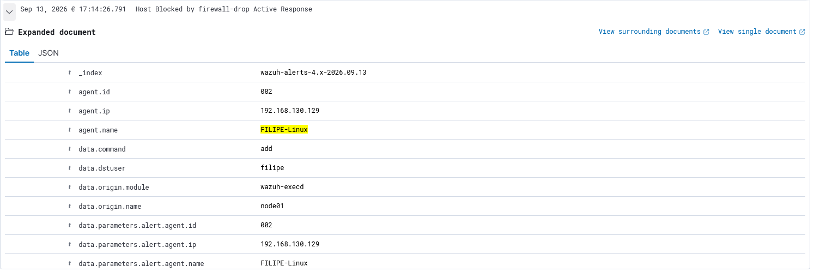

I then checked `iptables` on Ubuntu and confirmed that the source IP had been added to DROP rules.

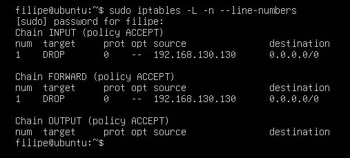

This was the part of the project I found most useful because it showed the full flow from detection to response.

## Problems I had to solve

The lab did not work perfectly on the first attempt.

Most of the troubleshooting was around:

- getting custom rules to trigger correctly;
- fixing configuration mistakes;
- matching the correct Windows event fields;
- testing the correlation logic;
- adjusting the dashboard;
- confirming that Active Response was actually blocking the source IP.

One example was the Windows Guest account rule. Because the Windows installation was in Portuguese, the target username was `Convidado`, not `Guest`. The rule only worked after I matched the event field to the actual value generated by the system.

That kind of troubleshooting helped me understand Wazuh much better than just following the installation steps.

## What I learned

By the end of the project I was more comfortable with:

- Wazuh server and agent configuration;
- Windows and Linux event monitoring;
- Sysmon telemetry;
- custom Wazuh rules;
- basic alert investigation;
- MITRE ATT&CK mapping;
- SSH brute-force detection;
- Active Response;
- validating firewall rules with `iptables`.

This project also made me more interested in SOC and Blue Team work. I still want to explore other areas of cybersecurity before deciding which path fits me best.

## Next steps

There are a few things I would like to add later:

- custom tuning of the existing Olaf Hartong community Sysmon configuration;
- File Integrity Monitoring scenarios;
- more PowerShell detections;
- network traffic analysis;
- threat-intelligence enrichment;
- more detailed dashboards and investigation workflows.

## Full report

The full project report is available here:

[Wazuh SOC Home Lab Portfolio Report](docs/Wazuh_SOC_Home_Lab_Portfolio_Report_Filipe_Dias.pdf)


## Disclaimer

This project was carried out in a controlled home-lab environment using systems that I owned and managed for learning purposes.
